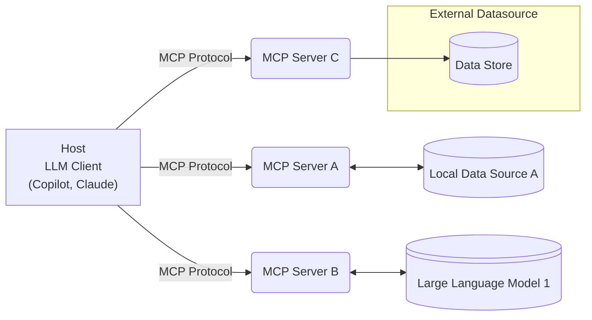

```mermaid
flowchart LR
    subgraph Ext["External Datasource"]
        DataStoreRest[(Data Store)]
    end
    A[Host <br>LLM Client <br>#40;Copilot, Claude#41;] -->|MCP Protocol| B(MCP Server A)
    A[Host <br>LLM Client <br>#40;Copilot, Claude#41;] -->|MCP Protocol| C(MCP Server B)
    A[Host <br>LLM Client <br>#40;Copilot, Claude#41;] -->|MCP Protocol| D(MCP Server C)
    B <--> E@{ shape: cyl, label: "Local Data Source A" }
    C <--> F@{ shape: lin-cyl, label: "Large Language Model 1"}
    D --> DataStoreRest
```
