# MCP Server

## Model Context Protocol

Dushyant Kumar  
27 April 2025

---

# Agenda

- What is MCP?
- Architecture
- Protocols Supported
- Conclusion

---

# What is MCP?

MCP (Model Context Protocol) is a standard introduced by [Anthropic](https://www.anthropic.com/) in Nov 2024. MCP is an effort to standardize connecting AI assistants to systems where data resides. 

MCP provides standard on passing context to AI LLMs allowing LLMs to make informed decisions and provide meaningful response. The common goals of MCP are
- Provide list of pre-built integrations that LLM can use
- Provide flexibility of chosing LLM provider and Data vendors
- Ensure best practices are followed to secure data within vendor infrastructure

---

# Architecture

---

# Architecture

## Protocol Layer

- A standard of client and server communication
- Defines schema for inputs (example. prompts, files) and outputs (example. embeddings, intermediate states)
- Define message types
- Handle streaming transport
- Handle Errors and Notifications
- Manage agent workflows (example. callling a tool or function)
- Encode sementic signals (example. start, stop, model hallucination risk warning)

---

# Architecture

## Transport Layer

- stdio
- sse (Server Sent Events)

All transports use [JSON-RPC 2.0](https://www.jsonrpc.org/) specifications to exchange messages

---

# Architecture

## Message Types

- Requests (request-response message)
- Results (request-response message)
- Errors (termination message)
- Notifications (one way message)

All transports use [JSON-RPC 2.0](https://www.jsonrpc.org/) specifications to exchange messages

---

# Conclusion

## Key Takeaways

- Point A
- Point B
- Call to action

---

# Thank You!

## Any Questions?

